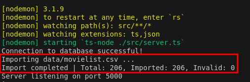

# OUTSERA - Technical Challenge

Develop a RESTful API to enable reading the list of nominees and winners in the Worst Picture category of the Golden Raspberry Awards.

## Requirements to Run the Application

Place a CSV file in the `data` directory named `movielist.csv`. This file must contain the following columns:

- **year** (numbers only)
- **title**
- **studios**
- **producers**
- **winner** (only "yes", "no", or empty)

All columns mentioned above are mandatory.

There are two example files inside the `data` folder:
* ``data/movielist-example1.csv``
* ``data/movielist-example2.csv``

## Project Requirements

To run the project, you need **Node.js** version 18.20.5 (or higher) installed on your machine.

### How to Run the Project

1. Ensure that **Node.js** is installed.
2. Run the following commands to start the project:

   ```bash
   npm install
   npm run start:dev
   ```

3. Verify that the data from the file `./data/movielist.csv` has been imported correctly.

   

4. If the import is successful, you can access the following endpoint:

   ```
   GET http://localhost:5000/api/v1/producers/award-intervals
   ```

### Integration Tests

To run the integration tests, use the following command:

```bash
npm run test
```